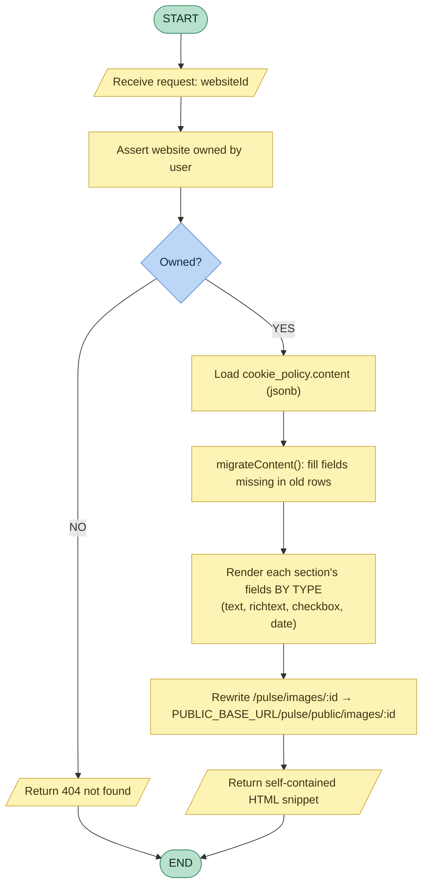
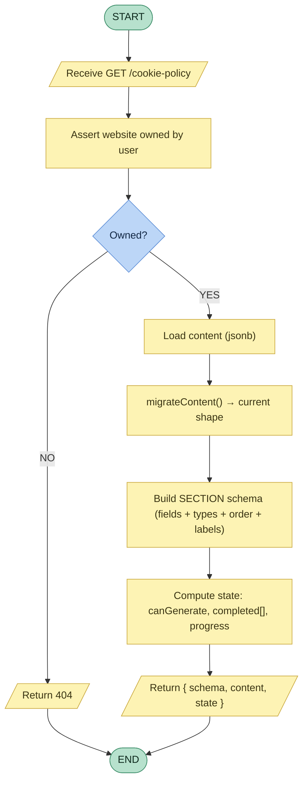
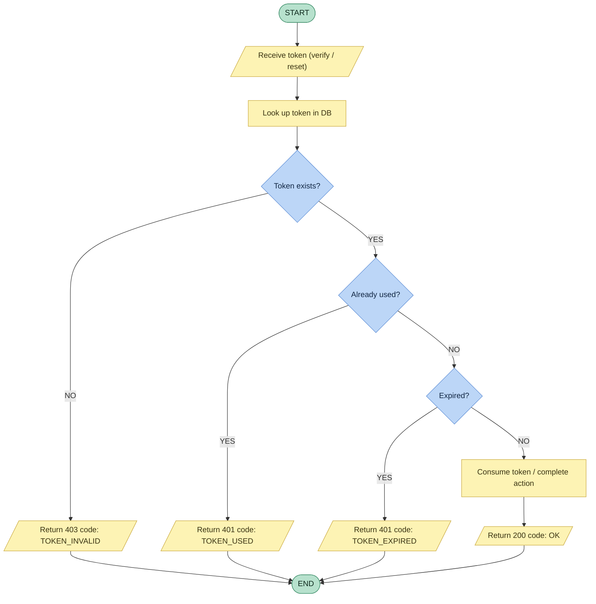
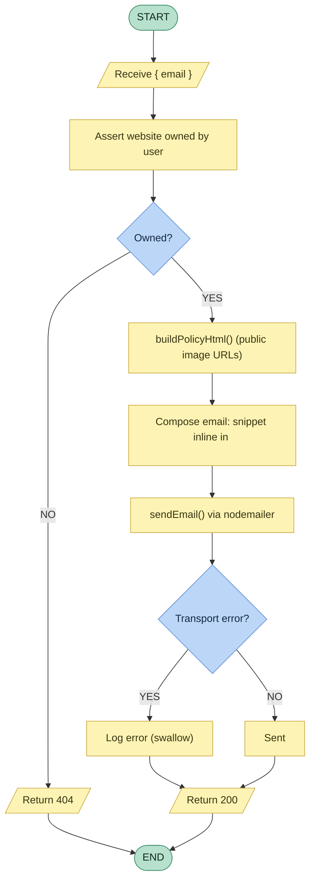
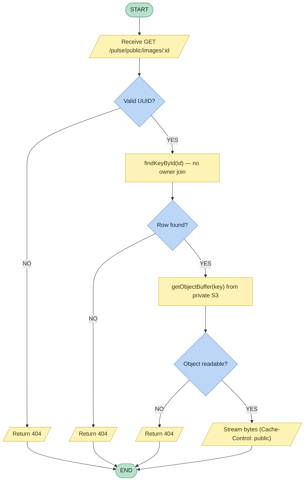

# Backend-Driven Flowcharts (per feature)

Process flowcharts for each backend-driven flow, in the classic notation:

- **Green stadium** = START / END (terminator)
- **Yellow rectangle** = process step (server does work)
- **Yellow parallelogram** = input / output (request in, response out)
- **Blue diamond** = decision, with **YES / NO** branches

Each flow names **what the backend owns** (the source of truth). Companion to
`rfc-backend-driven-architecture.md`.

---

## 1. Render the cookie policy (export / email HTML)

The server owns the whole render: ownership, content load, **migration of old rows**, rendering
**each field by its type**, and rewriting image refs to public URLs. The client never composes HTML.

---

## 2. Load the editor (server-driven schema + content + state)

The server returns the **schema** (which sections/fields exist, their types/labels/order), the
**content**, and the **computed state** (`canGenerate`, completed, progress). The client just renders.

---

## 3. Auth token check with TYPED error codes

The server classifies the outcome and returns a **stable code** (`TOKEN_EXPIRED` /
`TOKEN_USED` / `TOKEN_INVALID` / `OK`). The client routes on the **code**, never on message text.

---

## 4. Send policy code to a teammate

Server builds the same HTML (public image URLs → small snippet), inlines it in the email, and
sends it; mail-transport errors are **swallowed** so the request still succeeds.

---

## 5. Serve a public policy image (bytes from private S3)

The public route streams bytes from the **still-private** S3 bucket (read server-side). No auth,
no ownership — cookie-policy images are public-by-intent.

