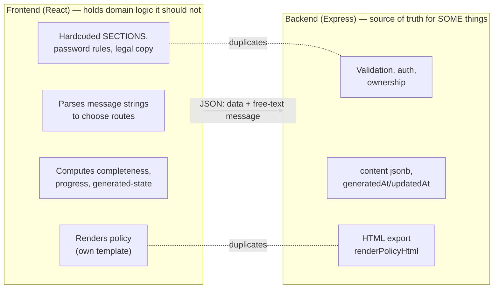
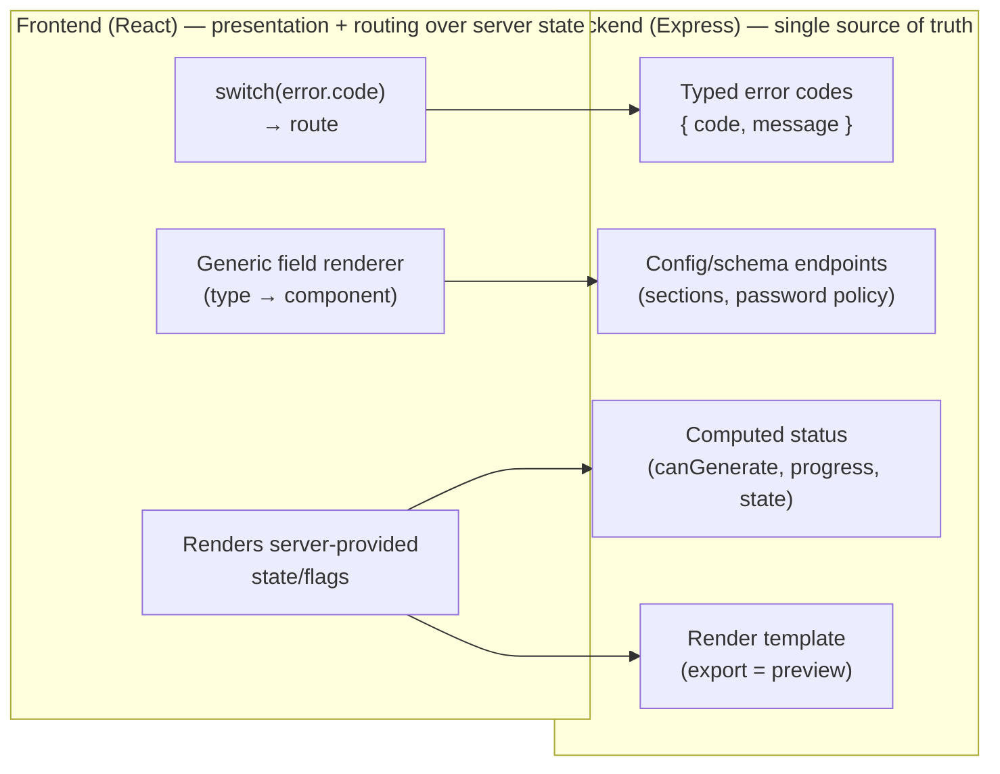
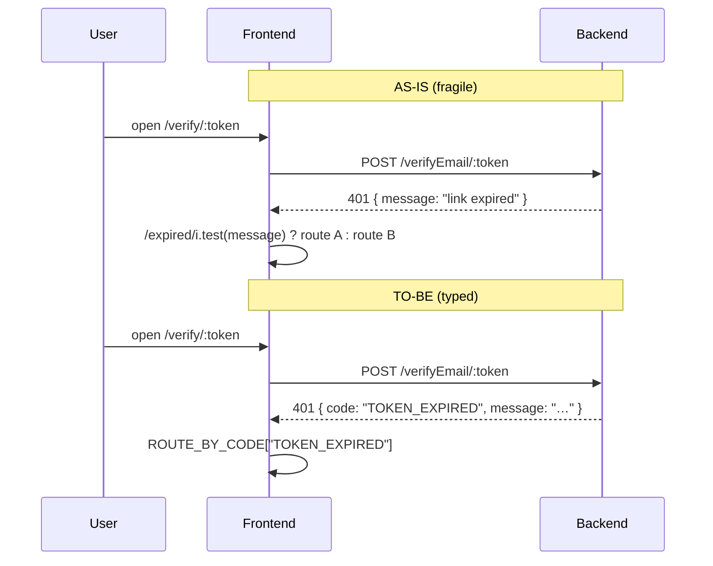
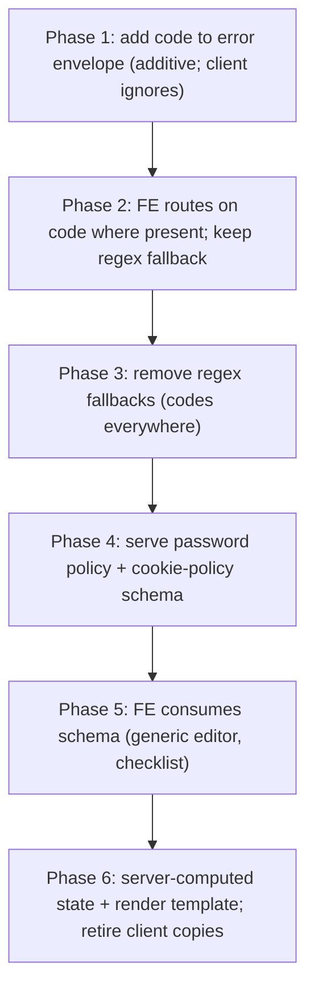

# RFC: Backend-Driven Architecture for the Pulse App

|                             |                                                                                       |
| --------------------------- | ------------------------------------------------------------------------------------- |
| **Status**                  | Draft — for review                                                                    |
| **Author**                  | (you)                                                                                 |
| **Reviewers**               | (manager / team)                                                                      |
| **Scope**                   | Whole app — auth flow + cookie-policy module + shared client/server contracts         |
| **Supersedes / relates to** | `backend-driven-architecture.md` (cookie-policy module deep-dive), the frontend audit |

---

## 1. Context & problem

Pulse is a React 19 SPA (`frontend/`) talking to an Express + Postgres/Redis API
(`backend/`). Over time, **domain logic that should be owned by the server has leaked into
the client**. Two concrete anti-patterns dominate:

1. **The frontend routes users by parsing the backend's English `message` strings.** e.g.
   "was this token _expired_ or _used_?" is decided by `/(expired|used)/i.test(message)`. A
   copy-edit to a server message silently breaks client navigation. There is no typed contract.
2. **Domain rules & config are duplicated across both repos** (password policy, cookie-policy
   section model, "is it complete?", the rendered-policy template, the empty-text rule). The
   two copies drift; a change needs edits in two places and can pass review in one.

Both make the system fragile and hard to evolve. A frontend audit (see Appendix B) catalogued
the specific sites.

**Thesis:** the backend should be the **single source of truth** for rules, configuration,
status, and outcomes; the frontend should be a **renderer + router over server-provided
state/codes**, holding only presentation and UX-nicety logic.

## 2. Goals / Non-goals

**Goals**

- G1. Client navigation and ret/rotation decisions key off **stable, typed error codes**, never message text.
- G2. Domain **configuration** (cookie-policy sections/fields, password policy, legal/render copy) is **served by the backend**, defined once.
- G3. Domain **status** (policy completeness, "generated", progress) is **computed server-side** and returned; the client renders it.
- G4. Each change ships **incrementally**, app always working (assignment R8).

**Non-goals**

- N1. Server-rendering every pixel / a "thin client". Presentation stays on the client.
- N2. A user-configurable form builder (schema is developer-defined, served to the client).
- N3. Rewriting auth/session mechanics — only the **error contract** and where **decisions** are made.
- N4. Out-of-scope product areas (cookie scanning, multi-language, consent banner, CMS publish).

## 3. Current architecture (as-is)

Truth is split across both tiers; the client re-derives or parses server concepts.



Representative sites (full list in Appendix B):

| Category                | Example                                              | File:line                                                              |
| ----------------------- | ---------------------------------------------------- | ---------------------------------------------------------------------- |
| Message-string routing  | verify-email outcome → page via `/expired/`,`/used/` | `VerifyEmailPage.jsx:42-53`                                            |
| "                       | token rotation via `/expired/i`                      | `lib/apiFetch.js:43`                                                   |
| "                       | lock vs rate-limit via `429 && /lock/i`              | `LoginPage.jsx:92-110`                                                 |
| Duplicated rules/config | password policy replicated                           | `SignupPage.jsx:8-24`                                                  |
| "                       | cookie-policy `SECTIONS` model                       | `CookiePolicyPage.jsx:29-59`                                           |
| "                       | empty-text rule (3 copies)                           | `CookiePolicyPage.jsx:21`, `PolicyDocument.jsx:13`, `policyHtml.js:59` |
| Client-computed status  | completeness / `canGenerate`                         | `CookiePolicyPage.jsx:148-160`                                         |
| "                       | preview-vs-wizard via `generatedAt`                  | `WebManagerPage.jsx:54-75`                                             |
| Duplicated render       | policy template + legal copy                         | `PolicyDocument.jsx:37-61`, `PolicyPreviewPage.jsx:361-368`            |

## 4. Proposed architecture (to-be)

Three moves; the backend gains a **typed contract** and the frontend becomes a renderer/router.



**Move 1 — Typed error codes (auth flow).** Every error envelope carries a stable `code`;
the client switches on `code`, never on `message`. Messages become display-only/i18n-able.

**Move 2 — Config/schema from the server.** Cookie-policy section/field **schema**, password
**policy**, and legal/render **copy** come from the backend, defined once. (Cookie-policy schema
detail: `backend-driven-architecture.md`.)

**Move 3 — Server-computed status.** `canGenerate`, completeness, progress, and "generated"
routing state are computed by the server and returned; the client renders them.

### Sequence — before vs after (verify-email is the archetype)



## 5. Design & contracts

### 5.1 Error envelope + code enum

Extend the existing error shape (`{ success:false, message, errors }`) with a `code`:

```jsonc
{ "success": false, "code": "TOKEN_EXPIRED", "message": "…", "errors": [] }
```

Proposed v1 enum (derived from the audit's message-parsing sites):

| code                   | Replaces message-match               | Client action                  |
| ---------------------- | ------------------------------------ | ------------------------------ |
| `TOKEN_EXPIRED`        | `/expired/i` (verify, reset, rotate) | route to expired/resend        |
| `TOKEN_USED`           | `/used/i`                            | route to already-done          |
| `TOKEN_INVALID`        | `403` on token                       | inline invalid state           |
| `SESSION_INVALIDATED`  | `/invalidated/i`                     | force logout → `/login`        |
| `ACCESS_TOKEN_EXPIRED` | `/expired/i` in `apiFetch`           | rotate + retry                 |
| `ACCOUNT_LOCKED`       | `429 && /lock/i`                     | show lock wait                 |
| `IP_RATE_LIMIT`        | `429` (other)                        | show rate-limit wait           |
| `EMAIL_UNVERIFIED`     | `403 && /verify/i`                   | route to verification-required |
| `EMAIL_TAKEN`          | `409 && /email/i`                    | inline "email exists"          |

The frontend keeps a single `ROUTE_BY_CODE` / `handleByCode` map; message text is never
inspected. Unknown code → generic fallback.

### 5.2 Config/schema endpoints

- **Cookie-policy schema** — served in `GET …/cookie-policy` (sections, field defs+types,
  order, labels, defaults, `policyFields`, `state`). Contract in `backend-driven-architecture.md` §5.
- **Password policy** — `GET /pulse/users/password-policy` → `{ minLength, requireUpper,
requireLower, requireNumber, specialCharPattern, noSpaces, rules:[{id,label}] }`. Signup renders
  the checklist from this instead of hardcoding it.
- **Legal/render copy** — the policy template strings + Disclaimer move behind the server
  (render endpoint / config), so preview == export by construction.

### 5.3 Server-computed status

`GET …/cookie-policy` returns `state: { generated, canGenerate, completed:[…], incomplete:[…],
progress }`. WebManager routes on `state.generated`; the wizard renders `canGenerate`/progress.

## 6. Change map

**Backend**

- Error envelope + `code` on every `ApiError` (add `code` param; global handler emits it). Set codes in auth controllers/middleware (`login`, `verifyMail`, reset/verify token middleware, `jwtValidation`, `rotateToken`).
- New/extended endpoints: cookie-policy schema in the GET; `GET /password-policy`; policy render/template + `state` computation.
- `openapi.yaml` + `CLAUDE.md`: document codes, schema, `state`.

**Frontend**

- `lib/apiFetch.js` — rotate/logout on `code`, not regex.
- `VerifyEmailPage`, `ResetPasswordPage`, `LoginPage`, `SignupPage` — route via `code`.
- `SignupPage` — render password checklist from `/password-policy`.
- `CookiePolicyPage` — sections/fields/validation/completeness/progress from schema+state (see module doc).
- `WebManagerPage` — route on `state.generated`.
- `PolicyDocument` — render from server template/HTML; drop the duplicated copy + `hasText`.

## 7. Alternatives considered

- **A. Keep message parsing, just centralize the regexes.** Rejected — still couples routing to
  prose; breaks on copy edits/i18n.
- **B. Full server-driven UI (server returns component trees).** Rejected (N1/N2) — over-engineered
  for this app; heavy, hurts UX latency, little payoff for a fixed feature set.
- **C. Do nothing.** Rejected — drift and fragility already observed (three copies of the empty
  rule; two section-key lists).
- **Chosen: typed contract + served config/status, thin domain-logic client.** Best
  cost/benefit; incremental.

## 8. Migration / rollout (phased, each shippable)



Each phase = one plan doc in `backend/cookiegenerator-plan/` + normal verify-and-ship. Phases 1–3
are backward-compatible (add code, then consume, then remove fallback), so nothing breaks mid-flight.

## 9. Risks, trade-offs, impact

- **Security:** codes must not leak more than messages do (e.g. keep "email exists" behaviour consistent with current UX). Server remains the validation authority regardless of any client mirror.
- **Performance:** one extra small config fetch (password policy / schema) — cache it; negligible.
- **Testing:** add contract tests asserting each auth failure returns the right `code`; extend `scripts/smoke.js`.
- **Over-centralization risk (watch):** keep legitimate UX on the client (empty-field guards, `401/403→/login`, date formatting, file `accept`). Not everything moves — see Appendix A.
- **Rollback:** phases 1–2 are additive; revert is safe. Phase 3+ requires the codes to be live first.

## 10. Open questions

- Error `code` as a **top-level field** vs inside `errors[]`? (Proposed: top-level.)
- Schema **embedded** in `GET …/cookie-policy` vs a dedicated `…/schema` endpoint?
- Preview: **inject server-rendered HTML** vs **client render by field type**? (Server HTML guarantees export==preview.)
- Field-type vocab for v1 (`text/richtext/checkbox/date`) — sufficient?
- Does a new policy field change **legal meaning** for already-generated users (→ `schemaVersion` "review & regenerate")?

## Appendix A — What stays on the frontend (by design)

Empty-field guards (`LoginPage` password-required `:50-54`, `PolicyPreviewPage` email `:186`,
wizard required-field hints); `401/403 → /login` (status-based); `MONTHS`/`WEEKDAYS`
(`dateUtils.js`); file `accept="image/png,image/jpeg"`; date formatting/fallbacks; the
"submit-as-is, render backend 422s" pattern (already ideal). Layout, motion, modals, spinners,
clipboard, routing _mechanics_.

## Appendix B — Full frontend audit

The complete categorized inventory (5 categories, per-site file:line, move-vs-keep verdicts)
backs §3 and the change map. Reproduce/attach the audit output here for the record.

## Appendix C — References

- Module deep-dive: `backend-driven-architecture.md` (cookie-policy schema/editor).
- Migration technique: the lazy-migration approach (`migrateContent` + `schemaVersion`).
- Existing contracts: `backend/openapi.yaml`, `backend/CLAUDE.md`, `frontend/CLAUDE.md`.
